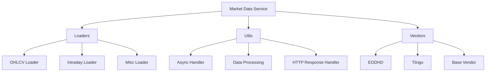

[](https://github.com/lolay92/data-service/actions/workflows/ci.yml)

# Market Data Service

A flexible and extensible market data service capable of integrating multiple vendors for fetching financial market data.

## Project Structure

```
data-service/
├── src/
│   └── data_services/
│       ├── loaders/
│       ├── utils/
│       └── vendors/
├── tests/
├── db/
├── logs/
├── out/
└── ...
```

## Features


- Asynchronous data fetching
- OHLCV (Open, High, Low, Close, Volume) data retrieval
- Intraday data support (incoming)
- Extensible architecture for easy addition of new data vendors

## Installation

1. Clone the repository:
   ```
   git clone https://github.com/your-username/data-service.git
   cd data-service
   ```

2. Install dependencies using Poetry:
   ```
   poetry install
   ```

3. Set up the database:
   ```
   cd db
   ./initdb.sh
   ```

## Configuration

1. Create a `.env` file in the project root and add your API keys:
   ```
   EODHD_API_KEY=your_eodhd_api_key
   TIINGO_API_KEY=your_tiingo_api_key
   ```

2. Configure your data universes in `src/data_services/utils/universe.py`.

## Usage

Here's a basic example of how to use the market data service:

```python
from data_services.vendors.eodhd import Eodhd
from data_services.utils.universe import Universe
from data_services._loader import getData

# Define your universe
universe = Universe.ETF 

# Fetch OHLCV data
data = getData(Eodhd, universe, start_date='2023-01-01', end_date='2023-12-31')

# Process the data
print(data.head())
```

## Adding a New Vendor

1. Create a new file in `src/data_services/vendors/` (e.g., `new_vendor.py`).
2. Implement the vendor class, inheriting from `vendor.MarketDataVendor`.
3. Override necessary methods like `fetchOhlcv`, `fetchIntraday`, etc.
4. Update `src/data_services/_loader.py` to include the new vendor.

## Running Tests

Execute the test suite using pytest:

```
pytest tests/
```

## Project Schema



## License

This project is licensed under the MIT License - see the LICENSE file for details.